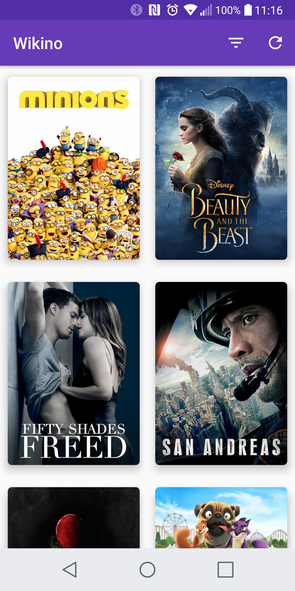
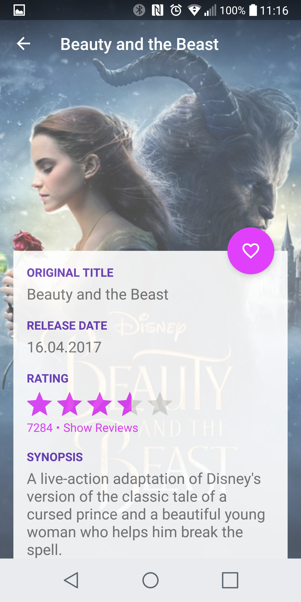
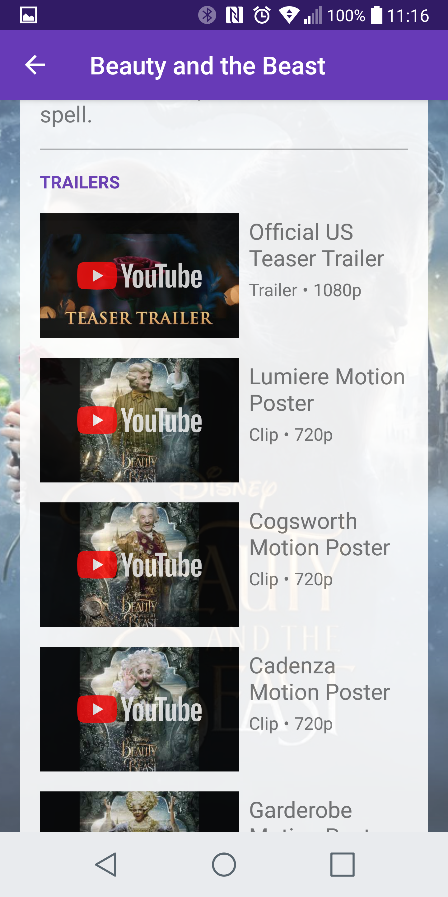
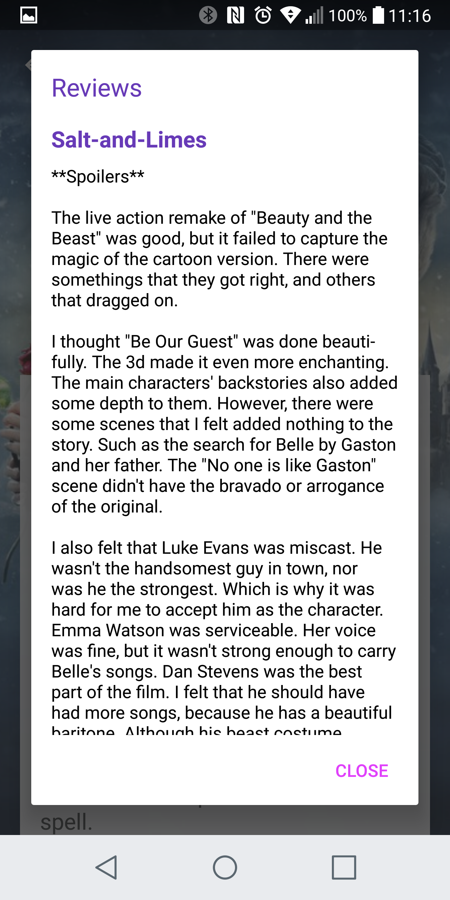
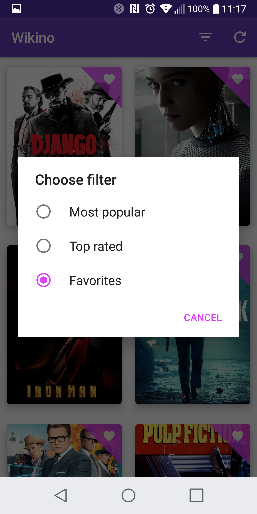

# Wikino
This project is from the Udacity Nanodegree - Advanced Android Development course (Project 1 and 2).

[Course Link](https://br.udacity.com/course/android-developer-nanodegree--nd801)

## Screenshots from the final app

## API
The project uses an API from The Movie DB.

Please add API_KEY="<YOUR_KEY>" into gradle.properties file in order to compile.

[API Link](https://developers.themoviedb.org/3)
